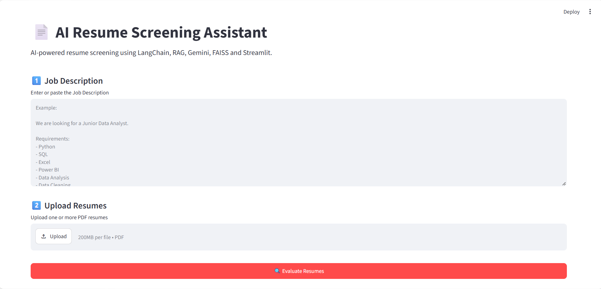
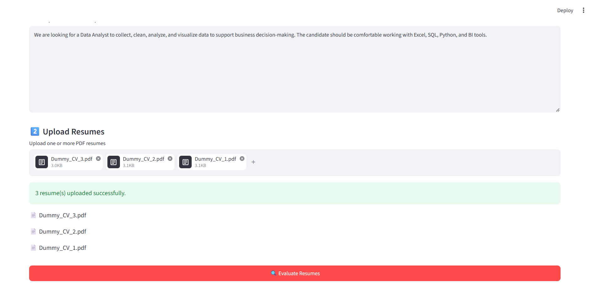
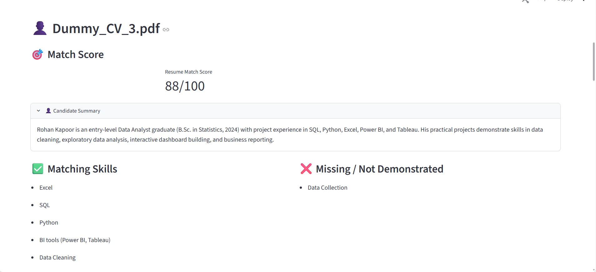
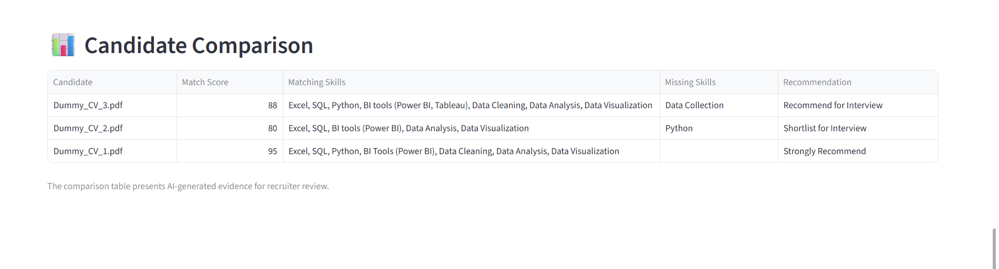

# AI_Resume_Screening_Assistant












An AI-powered Resume Screening Assistant built using **LangChain, Retrieval-Augmented Generation (RAG), Google Gemini, FAISS, Hugging Face Embeddings, Pydantic and Streamlit**.

The application allows users to upload one or more PDF resumes and compare them against a Job Description (JD). It retrieves relevant information from each resume and uses an LLM to generate a structured candidate evaluation.

---

## 📌 Project Overview

Recruiters often need to review multiple resumes against a specific Job Description. Manually comparing resumes with job requirements can be time-consuming.

This project automates the initial resume screening process using a **Retrieval-Augmented Generation (RAG)** pipeline.

The application:

- Accepts a Job Description from the user
- Allows uploading one or more PDF resumes
- Extracts text from resumes
- Splits resume text into smaller chunks
- Generates embeddings using a local Hugging Face embedding model
- Stores resume chunks in a FAISS vector database
- Retrieves resume information relevant to the Job Description
- Sends the retrieved context to Google Gemini
- Generates a structured resume evaluation
- Displays candidate results through a Streamlit interface
- Provides a comparison table when multiple resumes are uploaded

---

# 🎯 Objectives

The main objectives of this project are:

1. Build an AI-powered Resume Screening Assistant.
2. Implement a Retrieval-Augmented Generation (RAG) pipeline using LangChain.
3. Use a PDF document loader to process resumes.
4. Split resume documents into smaller chunks.
5. Generate semantic embeddings using Hugging Face.
6. Store and retrieve resume information using FAISS.
7. Use Google Gemini as the Large Language Model (LLM).
8. Use a prompt template to evaluate resumes against a Job Description.
9. Use Pydantic Output Parser for structured responses.
10. Build an interactive Streamlit application.
11. Support multiple resume uploads.
12. Compare candidate evaluations.

---

# 🛠️ Technologies Used

## Programming Language

- Python

## AI / LLM

- Google Gemini
- LangChain
- LangChain Google GenAI integration

## Retrieval-Augmented Generation

- RAG
- FAISS
- Hugging Face Sentence Transformers
- `sentence-transformers/all-MiniLM-L6-v2`

## Document Processing

- PyPDF
- LangChain PDF Loader
- Recursive Character Text Splitter

## Structured Output

- Pydantic
- Pydantic Output Parser

## Frontend / Deployment

- Streamlit

## Data Handling

- Pandas

## Environment Management

- Python virtual environment / Conda
- Python-dotenv

---

# 🏗️ System Architecture

The application follows the following architecture:

```text
                    Job Description
                          │
                          ▼
                  ┌───────────────┐
                  │ Prompt Template│
                  └───────┬───────┘
                          │
                          │
PDF Resume ──► PDF Loader
                  │
                  ▼
            Text Splitter
                  │
                  ▼
        Hugging Face Embeddings
                  │
                  ▼
             FAISS Vector DB
                  │
                  ▼
              Retriever
                  │
                  ▼
       Relevant Resume Context
                  │
                  ▼
           Google Gemini
                  │
                  ▼
        Pydantic Output Parser
                  │
                  ▼
       Structured Evaluation
                  │
                  ▼
           Streamlit Interface
